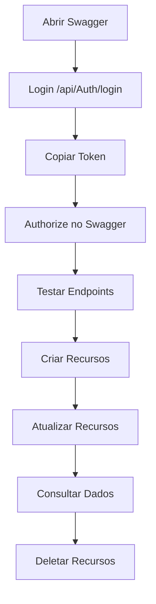

# ?? Guia de Testes Rápidos - ESG Diversity API

## ?? Quick Start - Testando em 5 Minutos

### ?? **Passo 1: Acesse o Swagger**

Abra no navegador:
```
http://localhost:5000
```

---

## ?? **Passo 2: Fazer Login**

### No Swagger UI:

1. **Localize** o endpoint `/api/Auth/login`
2. **Clique** em "Try it out"
3. **Cole** o JSON abaixo:

```json
{
  "username": "admin",
  "password": "password123"
}
```

4. **Clique** em "Execute"
5. **Copie** o valor do `token` da resposta

### Exemplo de Resposta:

```json
{
  "token": "eyJhbGciOiJIUzI1NiIsInR5cCI6IkpXVCJ9.eyJodHRwOi8vc2NoZW1hcy54bWxzb2FwLm9yZy93cy8yMDA1LzA1L2lkZW50aXR5L2NsYWltcy9uYW1laWRlbnRpZmllciI6IjEiLCJodHRwOi8vc2NoZW1hcy54bWxzb2FwLm9yZy93cy8yMDA1LzA1L2lkZW50aXR5L2NsYWltcy9uYW1lIjoiYWRtaW4iLCJodHRwOi8vc2NoZW1hcy54bWxzb2FwLm9yZy93cy8yMDA1LzA1L2lkZW50aXR5L2NsYWltcy9lbWFpbGFkZHJlc3MiOiJhZG1pbkBlc2dkaXZlcnNpdHkuY29tIiwiaHR0cDovL3NjaGVtYXMubWljcm9zb2Z0LmNvbS93cy8yMDA4LzA2L2lkZW50aXR5L2NsYWltcy9yb2xlIjoiQWRtaW4iLCJqdGkiOiI3ZjM1NGE4ZC0wMmQ0LTRhYmUtYjk4Zi1mYzFjZWU5MjE3MmQiLCJleHAiOjE3MDU3NjE4NzAsImlzcyI6IkVTR0RpdmVyc2l0eUFQSSIsImF1ZCI6IkVTR0RpdmVyc2l0eUFQSSJ9.Hs8K3FMqZnA5xJ7pT2dC9rK4sL1mN6wO3vE8yQ4uI0",
  "username": "admin",
  "email": "admin@esgdiversity.com",
  "role": "Admin",
  "expiresAt": "2024-01-20T15:11:10Z"
}
```

---

## ?? **Passo 3: Autorizar no Swagger**

1. **Clique** no botão **?? Authorize** (canto superior direito)
2. **Digite**: `Bearer {cole_seu_token_aqui}`
3. **Clique** em "Authorize"
4. **Clique** em "Close"

Agora todos os endpoints protegidos estão desbloqueados! ?

---

## ?? **Passo 4: Criar um Funcionário**

### No Swagger UI:

1. **Localize** `/api/Employees` (POST)
2. **Clique** em "Try it out"
3. **Cole** o JSON:

```json
{
  "name": "Maria Silva",
  "email": "maria.silva@company.com",
  "gender": "Female",
  "ethnicity": "Mixed",
  "department": "IT",
  "position": "Senior",
  "salary": 95000,
  "hireDate": "2024-01-20T00:00:00Z",
  "isDisabled": false,
  "ageGroup": 32,
  "educationLevel": "Master"
}
```

4. **Clique** em "Execute"

### Resposta Esperada (201 Created):

```json
{
  "id": 501,
  "name": "Maria Silva",
  "email": "maria.silva@company.com",
  "gender": "Female",
  "ethnicity": "Mixed",
  "department": "IT",
  "position": "Senior",
  "salary": 95000,
  "hireDate": "2024-01-20T00:00:00Z",
  "isDisabled": false,
  "ageGroup": 32,
  "educationLevel": "Master",
  "isActive": true
}
```

---

## ?? **Passo 5: Listar Funcionários**

1. **Localize** `/api/Employees` (GET)
2. **Clique** em "Try it out"
3. **Configure** os parâmetros:
   - `page`: 1
   - `pageSize`: 10
   - `department`: IT
4. **Clique** em "Execute"

Você verá Maria Silva na lista! ??

---

## ?? **Passo 6: Criar uma Meta de Diversidade**

### No Swagger UI:

1. **Localize** `/api/DiversityGoals` (POST)
2. **Cole** o JSON:

```json
{
  "department": "Engineering",
  "metricType": "Women in Leadership",
  "targetPercentage": 40,
  "currentPercentage": 25,
  "targetDate": "2025-12-31T00:00:00Z",
  "notes": "Increase women representation in leadership positions"
}
```

3. **Clique** em "Execute"

---

## ?? **Passo 7: Criar um Evento de Inclusão**

### No Swagger UI:

1. **Localize** `/api/InclusionEvents` (POST)
2. **Cole** o JSON:

```json
{
  "title": "Women in Tech Conference",
  "description": "Annual conference celebrating women in technology",
  "eventDate": "2024-06-15T09:00:00Z",
  "category": "Conference",
  "participantsCount": 150,
  "budget": 12000,
  "department": "IT"
}
```

3. **Clique** em "Execute"

---

## ?? **Testes Adicionais**

### 1. Atualizar Funcionário

```http
PUT /api/Employees/501
```

```json
{
  "position": "Lead",
  "salary": 110000
}
```

### 2. Consultar Métricas de Diversidade

```http
GET /api/DiversityMetrics?page=1&pageSize=5&department=IT
```

**Não precisa de autenticação!** ?

### 3. Ver Progresso das Metas

```http
GET /api/GoalProgress?page=1&pageSize=10
```

**Não precisa de autenticação!** ?

### 4. Análise de Equidade Salarial

```http
GET /api/SalaryEquity?page=1&pageSize=10
```

**Requer autenticação!** ?? (Admin ou HR)

---

## ?? **Testando Diferentes Usuários**

### Usuário HR (Recursos Humanos):

```json
{
  "username": "hr_manager",
  "password": "password123"
}
```

**Pode:**
- ? Criar/Editar funcionários
- ? Criar/Editar metas
- ? Criar/Editar eventos
- ? Ver equidade salarial
- ? Deletar recursos

### Usuário Comum:

```json
{
  "username": "user",
  "password": "password123"
}
```

**Pode:**
- ? Ver funcionários
- ? Ver eventos
- ? Criar/Editar/Deletar
- ? Ver equidade salarial
- ? Ver/Criar metas

---

## ?? **Cenários de Teste**

### ? Cenário 1: Onboarding de Novo Funcionário

1. Login como Admin/HR
2. POST `/api/Employees` - Criar funcionário
3. GET `/api/Employees/{id}` - Verificar criação
4. GET `/api/DiversityMetrics` - Ver impacto nas métricas

### ? Cenário 2: Definir Meta de Diversidade

1. Login como Admin/HR
2. POST `/api/DiversityGoals` - Criar meta
3. GET `/api/GoalProgress` - Ver progresso
4. PUT `/api/DiversityGoals/{id}` - Atualizar progresso

### ? Cenário 3: Organizar Evento

1. Login como Admin/HR
2. POST `/api/InclusionEvents` - Criar evento
3. GET `/api/InclusionEvents` - Listar eventos
4. PUT `/api/InclusionEvents/{id}` - Marcar como "Completed"

### ? Cenário 4: Análise de Equidade

1. Login como Admin/HR
2. GET `/api/SalaryEquity?department=IT` - Ver gaps
3. PUT `/api/Employees/{id}` - Ajustar salários
4. GET `/api/SalaryEquity?department=IT` - Verificar melhoria

---

## ?? **Testando Erros**

### Teste 1: Login com Credenciais Erradas

```json
{
  "username": "admin",
  "password": "wrongpassword"
}
```

**Resultado**: 401 Unauthorized

### Teste 2: Criar Funcionário sem Autenticação

Remova o token e tente POST `/api/Employees`

**Resultado**: 401 Unauthorized

### Teste 3: Deletar como Usuário Comum

Login como "user" e tente DELETE `/api/Employees/501`

**Resultado**: 403 Forbidden

### Teste 4: Criar Funcionário com Email Duplicado

Tente criar funcionário com email já existente

**Resultado**: 400 Bad Request (depende da validação do banco)

---

## ?? **Matriz de Testes**

| Endpoint | Admin | HR | User | Sem Auth |
|----------|-------|----|----|----------|
| POST /api/Auth/login | ? | ? | ? | ? |
| GET /api/Employees | ? | ? | ? | ? |
| POST /api/Employees | ? | ? | ? | ? |
| PUT /api/Employees | ? | ? | ? | ? |
| DELETE /api/Employees | ? | ? | ? | ? |
| GET /api/DiversityMetrics | ? | ? | ? | ? |
| POST /api/DiversityGoals | ? | ? | ? | ? |
| GET /api/SalaryEquity | ? | ? | ? | ? |

---

## ?? **Checklist de Testes**

- [ ] Login com admin
- [ ] Login com hr_manager
- [ ] Login com user
- [ ] Criar funcionário
- [ ] Atualizar funcionário
- [ ] Deletar funcionário (apenas admin)
- [ ] Listar funcionários com filtro
- [ ] Criar meta de diversidade
- [ ] Atualizar meta
- [ ] Criar evento de inclusão
- [ ] Atualizar evento
- [ ] Ver métricas de diversidade (sem auth)
- [ ] Ver equidade salarial (com auth)
- [ ] Testar acesso negado (403)
- [ ] Testar não autenticado (401)

---

## ?? **Dicas**

1. **Use o Swagger** - É a forma mais fácil de testar
2. **Copie o token** - Guarde em um editor de texto
3. **Token expira** - Faça login novamente se necessário (60 minutos)
4. **Veja os logs** - O PowerShell mostra logs da aplicação
5. **Use o README** - Consulte para mais exemplos

---

## ?? **Fluxo Completo de Teste**



---

**Pronto! Agora você pode testar toda a API de forma completa! ??**
